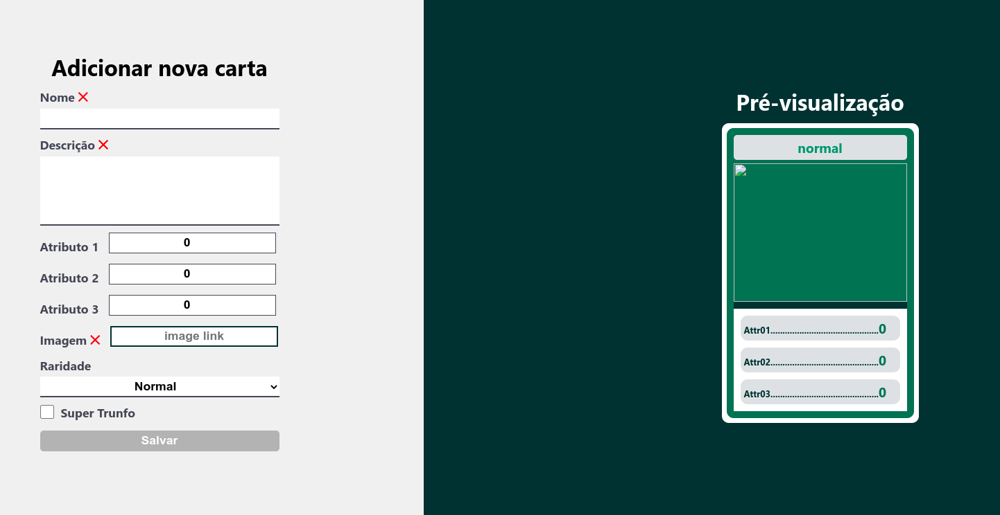

# Welcome to the Tryunfo project repository!

---

# Project developed by [Lucas Ximenes](https://www.linkedin.com/in/lucasdximenes/)

# Deployed on [Tryunfo](https://tryunfo-ashen.vercel.app/)

---

  
<strong>👨‍💻 What was developed</strong>
 

In this project was developed a game in the style of Super Trump! By using this application you will be able to:

- Create a deck with the free theme;

- Add and remove a card from the deck;

- View all cards that have been added to the deck;

- Play with the created deck.

  
<strong>:memo: My Skills</strong>
 

In this project we used:

- Read the state of a component and use it to change what we display in the browser

- Initialize a component, giving it a predefined state

- Update the state of a component

- Capture events using React syntax

- Create forms using JSX syntax with tags: `input`, `textarea`, `select`, `form`, `checkbox`

- Pass information from child components to parent components via callbacks

---

## How to use the project

  
<strong>‼️ Before you start developing</strong>
 

1. Clone the repository

- Use the command: `git clone git@github.com:lucasdximenes/tryunfo.git`.
- Enter the repository folder you just cloned:
  - `cd tryunfo`.

2. Install dependencies

- `yarn install`.

3. Run the command: `yarn start`.

---

## Additional Information

  
<strong>:information_source: Additional Information </strong>
 

### Super Trump Information

Super Trunfo is a card game that became very popular in Brazil between the 80's and 90's, but it is very successful until today. Its rules are quite simple, so it is considered an easy game to play. Despite having simple rules, each deck of Super Trump can have a different theme, which makes it a very fun game.

Originally, the game of Super Trump is made up of a deck of 32 cards. Each card represents an item related to the game's theme. On each card there is also a list of characteristics of that item and each characteristic has a numerical value.

To start the game, the cards must be shuffled and divided evenly for each participant. In each round, each person takes only the first card from their pile. In the first round a person chooses which trait they want to compare with the cards of the other people they are playing. Whoever has the highest number in this trait wins. The person who won the round receives the other people's cards and chooses which trait they want to compare in the next round. The game ends when someone has all the cards in the deck.

In each deck there is one (and only one) Super Trump card. This card beats all other cards in the deck, regardless of trait values.

The game of Super Trump can be made with almost any theme, but traditionally the most common ones are: cars, countries, cities or animals.

# Requirements

## 1. Create the form that will be used to add cards to the deck

Create a form that will be used to create the cards in your deck.

- Create a component called `Form` inside the `src/components` folder.

- Render the `Form` component inside the main `App` component.

- 

Create the following items inside the <code>Form</code> component:

  :bulb: **Hint:** You can create an input component. Remember to always have an associated label for each input.

  - a field of type `text` that contains the `data-testid="name-input"` attribute. This field will be used to enter the name of the letter.

  - a field of type `textarea` that contains the `data-testid="description-input"` attribute. This field will be used to enter the description of the letter.

  - a field of type `number` that contains the `data-testid="attr1-input"` attribute. This field will be used to enter the first attribute of the letter. It is free for you to add the attribute that best matches your deck.

  - a field of type `number` that contains the `data-testid="attr2-input"` attribute. This field will be used to enter the second attribute of the letter. It is free for you to add the attribute that best matches your deck.

  - a field of type `number` that contains the `data-testid="attr3-input"` attribute. This field will be used to enter the third attribute of the letter. It is free for you to add the attribute that best matches your deck.

  - a field of type `text` that contains the `data-testid="image-input"` attribute. This field will be used to enter the path to the image of the letter.

  - a field of type `select` that contains the attribute `data-testid="rare-input"`. This field will be used to enter the rarity of the card and should have the `options`: `normal`, `rare` and `very rare` (it is important that the options are in that order).

  - a field of type `checkbox` that contains the attribute `data-testid="trunfo-input"`. This field will be used to enter whether the card is Super Trump.

  - a `button` that contains the `data-testid="save-button"` attribute and has the text "Save".
  

  

<strong>Example image:</strong>

  

  
 

  
<strong>What will be checked</strong>
 

- It will be validated if there is a text input that has the `data-testid="name-input"`.

- It will be validated if there is a textarea input that has the `data-testid="description-input"`.

- It will be validated if there is an input number that has the `data-testid="attr1-input"`.

- It will be validated if there is an input number that has the `data-testid="attr2-input"`.

- It will be validated if there is an input number that has the `data-testid="attr3-input"`.

- It will be validated if there is a text input that has the `data-testid="image-input"`.

- It will be validated if there is a select input that has the `data-testid="rare-input"` with the `options`: `normal`, `rare` and `very rare`, in that order.

- It will be validated if there is an input checkbox that has the `data-testid="trunfo-input"`.

- It will be validated if there is a button that has the `data-testid="save-button"`.

---

## 2. Add the necessary props to the form component

- 

The <code>Form</code> component should receive the following props:

  - `cardName`, a string;
  - `cardDescription`, a string;
  - `cardAttr1`, a string;
  - `cardAttr2`, a string;
  - `cardAttr3`, a string;
  - `cardImage`, a string;
  - `cardRare`, a string;
  - `cardTrumfo`, a boolean;
  - `hasTrumfo`, a boolean;
  - `isSaveButtonDisabled`, a boolean;
  - `onInputChange`, a callback;
  - `onSaveButtonClick`, a callback;
  

- 

Props of the <code>Form</code> component should be used as indicated below:

  - `name-input` field: the `value` property must receive the value of the `cardName` prop and the `onChange` prop must receive the value of the `onInputChange` prop.

  - `description-input` field: the `value` property must receive the value of the `cardDescription` prop and the `onChange` prop must receive the value of the `onInputChange` prop.

  - `attr1-input` field: the `value` property must receive the value of the `cardAttr1` prop and the `onChange` prop must receive the value of the `onInputChange` prop.

  - `attr2-input` field: the `value` property must receive the value of the `cardAttr2` prop and the `onChange` prop must receive the value of the `onInputChange` prop.

  - `attr3-input` field: the `value` property must receive the value of the `cardAttr3` prop and the `onChange` prop must receive the value of the `onInputChange` prop.

  - `image-input` field: the `value` property must receive the value of the `cardImage` prop and the `onChange` prop must receive the value of the `onInputChange` prop.

  - `rare-input` field: the `value` property must receive the value of the `cardRare` prop and the `onChange` prop must receive the value of the `onInputChange` prop.

  - `trump-input` field: the `checked` property must receive the value of the `cardTrunfo` prop and the `onChange` prop must receive the value of the `onInputChange` prop.

  - `save-button` button: the `disabled` property must receive the value of the `isSaveButtonDisabled` prop and the `onClick` prop must receive the value of the `onSaveButtonClick` prop.

  **:bulb: Note:** for now the `hasTrunfo` prop hasn't been used yet, but don't worry, it will be used soon.
  
 

  
<strong>What will be checked</strong>
 

- It will be validated if the name field receives the value of the `cardName` prop and if the `onInputChange` callback is called when the field undergoes some change.

- It will be validated if the description field receives the value of the `cardDescription` prop and if the `onInputChange` callback is called when the field undergoes some change.

- It will be validated if the field of attribute 1 receives the value of the `cardAttr1` prop and if the `onInputChange` callback is called when the field undergoes some change.

- It will be validated if the field of attribute 2 receives the value of the prop `cardAttr2` and if the callback `onInputChange` is called when the field undergoes some change.

- It will be validated if the field of attribute 3 receives the value of the prop `cardAttr3` and if the callback `onInputChange` is called when the field undergoes some change.

- It will be validated if the image field receives the value of the `cardImage` prop and if the `onInputChange` callback is called when the field undergoes some change.

- It will be validated if the rarity field receives the value of the `cardRare` prop and if the `onInputChange` callback is called when the field undergoes some change.

- It will be validated if the Super Truff field receives the value of the `cardTrunfo` prop and if the `onInputChange` callback is called a when the field undergoes some change.

- It will be validated if the save button is enabled if the value of the `isSaveButtonDisabled` prop is `false`.

- It will be validated if the save button is disabled if the value of the `isSaveButtonDisabled` prop is `true`.

- It will be validated if the `onSaveButtonClick` callback is called when the button is clicked.

---

## 3. Create and render the Card component with the necessary props

- 

Create a component named <code>Card</code> in the folder <code>src/components</code> and render it in the main component <code>App</code>. The <code>Card</code> component must receive the following props: 

  - `cardName`, a string;
  - `cardDescription`, a string;
  - `cardAttr1`, a string;
  - `cardAttr2`, a string;
  - `cardAttr3`, a string;
  - `cardImage`, a string;
  - `cardRare`, a string;
  - `cardTrumfo`, a boolean;
  

- 

Render the <code>Card</code> component inside the main <code>App</code> component:

  - Display the value of the `cardName` prop. You can use any HTML tag that makes sense, as long as it has the `data-testid="name-card"` attribute.

  - Display the image using the `img` HTML tag, with the `src` attribute having the value of the `cardImage` prop and the `alt` attribute having the value of the `cardName` prop. This image must also have the `data-testid="image-card"` attribute

  - Display the value of the `cardDescription` prop. You can use any HTML tag that makes sense, as long as it has the `data-testid="description-card"` attribute.

  - Display the value of the `cardAttr1` prop. You can use any HTML tag that makes sense, as long as it has the `data-testid="attr1-card"` attribute.

  - Display the value of the `cardAttr2` prop. You can use any HTML tag that makes sense as long as it has the `data-testid="attr2-card"` attribute
  - Display the value of the `cardAttr3` prop. You can use any HTML tag that makes sense, as long as it has the `data-testid="attr3-card"` attribute.

  - Display the value of the `cardRare` prop. You can use any HTML tag that makes sense, as long as it has the `data-testid="rare-card"` attribute.

  - Display the `Super Trump` text only when the value of the `cardTrumfo` prop is `true`. You can use any HTML tag that makes sense, as long as it has the `data-testid="trunfo-card"` attribute.

  **Tip: You can use conditional rendering to render or not render the super trump text.**
  

Example Image:

 

  
<strong>What will be checked</strong>
 
  
  - It will be validated if the `data-testid="name-card"` component is displayed and has the value of the `cardName` prop.
  - It will be validated if the `data-testid="image-card"` component is displayed and has the `src` attribute with the `cardImage` prop value and the alt attribute with the `cardName` prop value.
  - It will be validated if the `data-testid="description-card"` component is displayed and has the value of the `cardDescription` prop.
  - It will be validated if the `data-testid="attr1-card"` component is displayed and has the value of the `cardAttr1` prop.
  - It will be validated if the `data-testid="attr2-card"` component is displayed and has the value of the `cardAttr2` prop.
  - It will be validated if the `data-testid="attr3-card"` component is displayed and has the value of the `cardAttr3` prop.
  - It will be validated if the `data-testid="rare-card"` component is displayed and has the value of the `cardRare` prop.
  - It will be validated if the `data-testid="trunfo-card"` component is displayed when the `cardTrumfo` prop has the value `true`.
  - It will be validated if the `data-testid="trump-card"` component is **not** displayed when the `cardTrumfo` prop has the value `false`.

---

## 4. Create the preview of the letter being created by the form

So far you've created two components that receive `props`, now it's time to create the components' state.
The `Form` and `Card` components will share the same state to display the same information (that already gives you a hint of where the state should be, doesn't it?).
When some information is entered in a field of the form, the `Card` component must display the same information in real time, creating a preview of the card before it is saved in the deck (the saving functionality will be done in the next requirements).

You should use the `onInputChange` prop to pass a callback to handle the `onChange` events of form inputs. Don't forget that input values ​​(which are also passed by props) must also be saved in a state.

**:bulb: Tip:** the same state used to control form inputs can be passed to the `Card` component.

<strong>Technical Information:</strong>

- When typing something in the field with the `data-testid="name-input"` of the form, the same value should be rendered in the `Card` component, in the element with the `data-testid="name-card"`.

- When typing something in the field with the `data-testid="description-input"` of the form, the same value should be rendered in the `Card` component, in the element with the `data-testid="description-card"`.

- When typing something in the field with the form's `data-testid="image-input"`, the same value must be passed to the `Card` component, and used in the `src` attribute of the element with the `data- testid="image-card"`.

- When typing something in the field with the `data-testid="attr1-input"` of the form, the same value should be rendered in the `Card` component, in the element with the `data-testid="attr1-card"`.

- When typing something in the field with the `data-testid="attr2-input"` of the form, the same value should be rendered in the `Card` component, in the element with the `data-testid="attr2-card"`.

- When typing something in the field with the `data-testid="attr3-input"` of the form, the same value should be rendered in the `Card` component, in the element with the `data-testid="attr3-card"`.

- When selecting some value in the `select` with the `data-testid="rare-input"` of the form, the same value must be rendered in the `Card` component, in the element with the `data-testid="rare-card "`.

- When the `checkbox` field that has the `data-testid="trunfo-input"` is `checked`, the `Super Trump` text must be rendered in the `Card` component inside the element with the `data- testid="trump-card"`.

**:bulb: Tip:** for fields that need a default value (like the rarity field, for example) you can start the state already with this value.

 

  
<strong>What will be checked</strong>
 

- It will be validated if the value entered in the form name input is rendered in the preview of the letter.
- It will be validated if the value entered in the form's Description input is rendered in the preview of the letter.
- It will be validated if the value entered in the input referring to attribute 1 in the form is rendered in the preview of the letter.
- It will be validated if the value entered in the input referring to attribute 2 in the form is rendered in the preview of the letter.
- It will be validated if the value entered in the input referring to attribute 3 in the form is rendered in the preview of the letter.
- It will be validated if the `data-testid="trunfo-card"` is rendered in the card preview if the Super Trump checkbox is selected.

---

## 5. Validate the Save button on the form

The button that has the attribute <code>data-testid="save-button"</code> should only be enabled if all the information in the form is filled in correctly, following the following rules:

- The `Name`, `Description`, `Image` and `Rarity` fields must contain some information (ie the `inputs` cannot be empty).

- The sum of the values ​​of the 3 attributes (`attr1-input`, `attr2-input` and `attr3-input`) cannot exceed the value **210**.

- Each of the three attributes can have **maximum 90 points each**.

- Attributes cannot receive negative values.

 

  
<strong>What will be checked</strong>
 

- It will be validated if the `save` button is disabled when the page is first rendered.
- It will be validated if the `save` button is disabled if the name field is empty.
- It will be validated if the `save` button is disabled if the image field is empty.
- It will be validated if the `save` button is disabled if the description field is empty.
- It will be validated if the `save` button is disabled if the field of attribute 1 is greater than 90.
- It will be validated if the `save` button is disabled if the field of attribute 1 is less than 0.
- It will be validated if the `save` button is disabled if the field of attribute 2 is greater than 90.
- It will be validated if the `save` button is disabled if the field of attribute 2 is less than 0.
- It will be validated if the `save` button is disabled if the field of attribute 3 is greater than 90.
- It will be validated if the `save` button is disabled if the field of attribute 3 is less than 0.
- It will be validated if the `save` button is disabled if the sum of the attribute fields is greater than 210.
- It will be validated if the `save` button is enabled when filling all the form fields correctly.

---

## 6. Create the save button function

Now that the save button is validated, you can add a new card to your deck. This means that you will need to create a new state in your application to save the list of existing cards in your deck.

:bulb: **Tip:** you can save each card in an object format and have an _array_ with those objects in their state.

- When clicking on the button that has the `data-testid="save-button"` attribute, the information that was filled in the form must be saved in the state of your application.

- After saving the information, the `inputs` of the `Name`, `Description` and `Image` form and the contents of the preview of the letter must be clean.

- After saving the information, the three attribute fields must have a value of 0.

- After saving the information, the `Rarity` field must contain the value `normal`.

 

  
<strong>What will be checked</strong>
 

- It will be validated if the form fields `Name`, `Description` and `Image` are cleared after clicking `save`.

- It will be validated if the three attribute fields have the value `0` after clicking `save`.

- It will be validated if the `Rarity` field has the `normal` value after clicking `save`.

---

## 7. Create the Super Trump validation

In a Super Trump deck there can only be <strong>one Super Trump card</strong>. That's why you need to validate so that only 1 Super Trump card is saved in your deck:

- In order for a card to be saved as a Super Trump, the input with the `data-testid="trump-input"` must be `checked` when saving the card. Therefore, validation will be done in this field. To do this validation, you must use the `hasTrunfo` prop of the `Form` component.

- If there is already a Super Trump card in your deck, the card creation form should not display the `checkbox` `data-testid="trump-input"`. In its place should be rendered the phrase: "You already have a Super Trump in your deck".

**Tip: Remember to use conditional rendering (in the [:convenience_store: Development](#guidelines) section of React in this requirement.**

 

  
<strong>What will be checked</strong>
 

- It will be validated if the Super Trump checkbox is rendered when loading the page.

- It will be validated if the text "You already have a Super Trump in your deck" is rendered if there is already a Super Trump card in the deck.

---

## 8. Display the list of cards that are saved in the state

You already have a lot of cool cards in your deck, now it's time to list them so you can see your entire collection!

- Render inside the `App` component a list with all the cards you have in the application state.
- Ensure that whenever a card is added, the list is automatically updated.

:bulb: **Hint:** you can reuse the `Card` component in this requirement. :bulb:

Example Image:

 

  
<strong>What will be checked</strong>
 

- It will be validated if the letter is rendered on the page when saving it.
- It will be validated if the list is automatically updated when a letter is added.

---

## 9. Create a button to remove a card from the deck

- 

Create on each card being rendered from your deck a <code>button</code> with the text <code>Delete</code> and the attribute <code>data-testid="delete -button"</code>.

  - The _preview_ card **cannot have this button**.

  - By clicking this button, the card must be deleted from your deck, that is, it must no longer be rendered on the page.
    **Tip: Remember that the deck is being rendered from the state of your component!**

  - If the deleted card is a Super Trump card, the form `checkbox` should appear again, making it possible to create a new Super Trump card.

  
  

  
<strong>What will be checked</strong>
 

- It will be validated if the `Delete` button is rendered on the screen only on cards added to the deck.
- It will be validated if when adding a card and then deleting it, the card is not rendered.
- It will be validated if when adding two cards and then deleting one, the card is not rendered.
- It will be validated if when deleting a Super Trump card, the checkbox in the form is rendered again.

---

# Bonus requirements

Your application will have three card listing filters: filter by **name**, by **rarity** and by **Super Trump**. The **name** and **rarity** filters are cumulative. The **Super Trump** filter works independently.

## 10. Create the filter by letter name

To filter the <strong>name</strong>, you must create a field of type <code>text</code> and add the attribute <code>data-testid="name-filter"</code>:

  
  * This field must always be rendered, even if there are no cards saved in the deck.
  
  * When typing in this field, only the letters that contain the typed text in the `name` must be rendered on the page.

 

  
<strong>What will be checked</strong>
 

- It will be validated if the filter field by name renders on the screen.
- It will be validated if only matching cards appear after the filter.
- It will be validated if it does not render any cards if there is no matching name.

---

## 11. Create the filter by card rarity

<fromtails>
To filter by <strong>rarity</strong>, you must create a field of type <code>select</code> and add the attribute <code>data-testid="rare-filter"</ code>:

- This `select` must have the following `options`:

  - `all`
  - `normal`
  - 'rare'
  - `very rare`

- By default, the `all` option will already be selected;

- When selecting one of the options, only cards that have the specified rarity should be rendered. If `all` is selected, there must be no rarity filter applied to the list.

- If the `Name` filter field is filled, the two filters (by name and by rarity) should work together.

 

  
<strong>What will be checked</strong>
 

- It will be validated if the filter field by Rarity renders on the screen.
- It will be validated if only `normal` rarity cards are displayed after the filter.
- It will be validated if only `rare` rarity cards are displayed after the filter.
- It will be validated if only cards with `very rare` rarity are displayed after the filter.
- It will be validated if all cards are displayed when the rarity filter has the `all` option selected.
- It will be validated if it does not render any cards if there is no corresponding rarity.

---

## 12. Create the Super Trump filter

To filter by <strong>Super Trump</strong>, you must create a field of type <code>checkbox</code> with the <code>label</code> Super Trump and the attribute < code>data-testid="trump-filter"</code>:

  
  * When selecting this `checkbox`, only the **Super Trump** card should be rendered.
  
  * As long as the `checkbox` has the `checked` attribute, that is, if it is selected, the `inputs` of the filters by name and rarity must have the `disabled` attribute.

- If the `checkbox` is not selected, the cards should be rendered normally, following only the rules of the previous filters.

 

  
<strong>What will be checked</strong>
 
  - It will be validated if only the super trump card is displayed when this filter is selected.

---

# Non-evaluative requirements

You have already created your Tryunfo deck. Now you can create a feature to play with other students! Below we will present a **suggestion** of how this functionality can be created! **These requirements will not be evaluated by the Evaluator**, so feel free to develop however you see fit! Use the knowledge you have learned and developed over the previous modules and exercise your creativity!

<strong>Game Rules</strong>

Before starting development, let's remember how the game works:

- First, each person must "take" a random card from their deck.
- The first person will choose an attribute to compare with the other person's card. Remember that in Tryunfo the attributes can have different names in each deck, so the ideal is to be based on the attribute position, that is, compare the first attribute of your card with the first attribute of the rival person's card.
- Whoever has the highest number in the chosen attribute wins the round.
- At the end of the round, each person must "take" a new random card.
- Each round the turn of who chooses the attribute for comparison is alternated.

 

<strong>What will be needed</strong>

To be able to play, you will need to have developed the following steps:

1. Create a deck with N cards (already developed in the previous requirements).
2. Create a function that shuffles the cards and renders the first card in the deck.
3. Create a button to render the next card in the deck.
4. On the last card, have a button to restart the game, shuffling again.

---

## 13. Start the game

- Create a button with the text `Play`;

- Create a new state in your application, which will receive the cards from your deck in random order;

- By clicking the `Play` button, this new state should receive the cards that are saved in your deck, but in **random** order
  see this link [how to implement a function that shuffles an array](https://flaviocopes.com/how-to-shuffle-array-javascript/).

- Create a new state in your application that will control the position in the array of the card that will be rendered.

- To render on the page, you can use **conditional rendering** to show the card only when a game is in progress.

**Remember that there are several possible ways to set up this function. This is just a suggestion.**

---

## 14. Create Next Letter button

- After clicking on `Play` and shuffling the existing cards, display the first card on the screen, that is, the card that is at position `0` in the array.

- display a button with the text `Next letter`.

- By clicking the "Next card" button, the next card in your "shuffled" deck must be rendered. You can use the state created in the previous requirement and increment it each round.

Example Image:

---

## 15. Restart the game

- When the last card in the deck is being rendered, i.e. when you are in the last position of the shuffled array of cards, the "Next card" button should not be rendered on the screen.

- A new button should appear with the text `Shuffle cards`.

- By clicking on the `Shuffle Cards` button the deck must be shuffled again and the state that controls the displayed card position must be `0` again.

Example Image:

---
